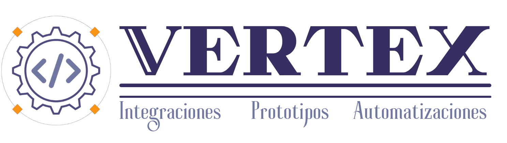

# 🖥️ Sustentación Ejecutiva — EvidentIA

<callout icon="🚀" color="blue_bg">
**EvidentIA: Copiloto de Entorno y Verificación Trazable para TVN Media** 
*Transformamos el flujo informativo: de la señal bruta a la decisión editorial con rigor periodístico inmutable, cero alucinaciones y matemática determinista.*
</callout>

<columns>
<column ratio="50">

**Datos del Reto & Sustentación**
- **Evento:** hackIAthon Panamá 2026 — 4ta Edición
- **Reto Oficial:** TVN Media — *"De la señal a la decisión"*
- **Extensión:** Inteligencia de Entorno y Banca
- **Equipo:** **Alek Rutherford** & **Pedro Carreras**

</column>
<column ratio="50">

**Accesos en Vivo al Entorno**
- 🌐 **Producción (Cloud Live):** [evidentia.vertexdc.com](https://evidentia.vertexdc.com)
- 🧪 **Staging / Dev:** [dev-evidentia.vertexdc.com](https://dev-evidentia.vertexdc.com)
- ⚙️ **Consola Jurado (T01–T10):** [/jurado](https://evidentia.vertexdc.com/jurado)
- 📚 **Swagger API Docs:** [/docs](https://evidentia-api.vertexdc.com/docs)

</column>
</columns>

---

<table_of_contents color="blue"/>

---

## ⚠️ El Desafío Editorial: La Trampa de la Inmediatez

<callout icon="⚠️" color="orange_bg">
**El dilema en la sala de redacción moderna:** 
Un periodista contemporáneo no sufre por escasez de noticias; sufre por saturación de ruido sin corroboración oportuna.
</callout>

<columns>
<column ratio="50">

### El Ruido Informativo Tradicional
- **Repetición Masiva:** Cuando 10 medios replican el mismo cable de agencia (ej. EFE o AP), la redacción percibe una falsa sensación de corroboración independiente.
- **Cifras Anacrónicas y Descontextualizadas:** Se publican titulares con cifras como *"El PIB subió 7%"* sin especificar año de corte, metodología o entidad emisora.
- **Tiempos de Ciclo Extenuantes:** Contrastar una pista requiere hasta 55 minutos entre bases de datos dispersas, llamadas y hemerotecas.

</column>
<column ratio="50">

### El Riesgo de los Modelos LLM Genéricos
- **Alucinación Epistémica:** Un chatbot convencional inventa fuentes que parecen verídicas o adjudica declaraciones a funcionarios equivocados.
- **Vulnerabilidad a Inyecciones:** Titulares maliciosos pueden manipular el contexto del prompt y alterar las conclusiones del redactor.
- **Riesgo Reputacional Crítico:** Para TVN Media, una sola retractación pública destruye años de credibilidad editorial acumulada.

</column>
</columns>

---

## 💡 Nuestra Tesis: Principios Rectores Innegociables

<callout icon="💡" color="yellow_bg">
**"Repetir no es corroborar. Prioridad no es certeza. La IA asiste; el ser humano decide."**

```mermaid
graph LR
  subgraph Fuentes["Señales en Tiempo Real"]
    RSS["Feeds RSS TVN"]
    BM["Banco Mundial API"]
    USGS["USGS Sismos en Vivo"]
  end

  subgraph Motor["Motor Inteligente EvidentIA"]
    Jaccard["Deduplicación Jaccard"]
    Scoring["Scoring Multicriterio (P)"]
    Graph["Light GraphRAG 60 FPS"]
    Abst["Abstención Estructurada"]
  end

  subgraph Redaccion["Sala de Redacción TVN"]
    Bandeja["Bandeja Priorizada"]
    Ficha["Ficha de Investigación"]
    Borrador["Borrador Marcado [HECHO]"]
    Aprobacion["Validación Periodística"]
  end

  Fuentes --> Motor
  Motor --> Redaccion
```

</callout>

---

## 🧬 Los 3 Pilares Tecnológicos de EvidentIA

### 1. Scoring Multicriterio Determinista {toggle="true" color="blue"}

En lugar de delegar el criterio editorial a la temperatura aleatoria de un modelo de lenguaje, EvidentIA aplica una fórmula matemática auditable:

$$\text{Prioridad } P = 30R + 25I + 20U + 15N + 10E$$

- **$R$ (Relevancia):** Coincidencia semántica con la agenda editorial de TVN y palabras clave prioritarias.
- **$I$ (Impacto):** Alcance poblacional y repercusión socioeconómica estimada.
- **$U$ (Urgencia):** Decaimiento temporal basado en la frescura del evento noticioso.
- **$N$ (Novedad):** Descuenta penalizaciones por saturación léxica de cables ya procesados.
- **$E$ (Evidencia Corroborada):** Recompensa exclusiva para temas respaldados por más de una fuente independiente y confiable.

### 2. Light GraphRAG Causal e Interactivo a 60 FPS {toggle="true" color="purple"}

- **Física Vectorial en SVG Nativo:** Renderizado fluido a 60 FPS sin sobrecarga de dependencias pesadas de canvas o WebGL.
- **Cruce Multimodal Instantáneo:** Un reporte vial de Chiriquí se conecta en milisegundos con un sismo reportado por el USGS y con el indicador macroeconómico del PIB agrícola de Panamá (`WB:PAN:NV.AGR.TOTL.ZS:2023`).
- **Navegación Panorámica y Filtros:** Permite arrastrar nodos, explorar relaciones de causa-efecto y saltar a la fuente canónica original en 1 clic.

### 3. Clasificación Epistémica y Abstención Formal {toggle="true" color="green"}

- **Marcado Estricto de Contenido:**
  - `[HECHO]`: Aseveración verificada con identificador de fuente inmutable (ej. `[WB:PAN:NY.GDP.MKTP.KD.ZG:2023]`).
  - `[DECLARACIÓN]`: Cita textual o atribuida a un vocero identificado (ej. `[TVN:104]`).
  - `[INFERENCIA]`: Conjetura analítica que requiere verificación humana antes de publicación.
- **Tolerancia Cero a la Alucinación (`abstained: true`):** Si una métrica o hecho no existe en el corpus corroborado, EvidentIA se abstiene formalmente en lugar de especular, indicando qué dato falta y qué consulta específica debe hacerse al MEF o a la entidad correspondiente.

---

## 🖥️ Flujo Operativo en Sala de Redacción (Live Demo)

<table fit-page-width="true" header-row="true">
<colgroup>
<col color="blue">
<col color="default">
<col color="green">
</colgroup>
<tr>
<td>Etapa del Flujo</td>
<td>Acción del Periodista / Editor</td>
<td>Garantía de EvidentIA</td>
</tr>
<tr>
<td>**1. Ingesta y Deduplicación**</td>
<td>Llegada automática de feeds RSS y carga documental manual</td>
<td>Deduplicación Jaccard con trazabilidad inmutable de `upload_id`</td>
</tr>
<tr>
<td>**2. Bandeja Inteligente**</td>
<td>Revisión de leads ordenados de más reciente a más antiguo</td>
<td>Cálculo transparente del Score $P$ y desglose de factores</td>
</tr>
<tr>
<td>**3. Grafo de Causalidad**</td>
<td>Exploración visual a 60 FPS de conexiones entre entidades</td>
<td>Descubrimiento de causas subyacentes y cruce Banco Mundial / USGS</td>
</tr>
<tr>
<td>**4. Redacción & Aprobación**</td>
<td>Generación de borrador con citas y validación del Editor Jefe</td>
<td>Marcado epistémico `[HECHO]`, exportación a Markdown y cero alucinaciones</td>
</tr>
</table>

---

## 🧪 Auditoría Técnica en Vivo: Suite T01–T10 en <7 Segundos

<callout icon="✅" color="green_bg">
**Consola `/jurado` en Producción:** 
Demostración empírica de cumplimiento del pliego en vivo: **10/10 pruebas en verde** ejecutadas de extremo a extremo en aproximadamente **6.8 segundos**.
</callout>

- [x] **T01 Ingesta Multifuente:** Ingesta simultánea de TVN RSS, Banco Mundial y USGS con esquema unificado.
- [x] **T02 Deduplicación Léxica:** Filtrado de cables redundantes mediante similitud Jaccard $J \ge 0.85$.
- [x] **T03 Scoring Determinista:** Priorización matemática sin variabilidad aleatoria ni drift de prompt.
- [x] **T04 Trazabilidad Canónica:** Formato de citas inmutables `WB:PAN:INDICADOR:AÑO` y enlaces directos.
- [x] **T05 GraphRAG Causal:** Resolución de caminos de causalidad entre eventos físicos y socioeconómicos.
- [x] **T06 Abstención Formal:** Respuesta estructurada `abstained: true` ante preguntas fuera de corpus.
- [x] **T07 Blindaje Anti-Prompt Injection:** Aislamiento con delimitadores XML `<untrusted_content>`.
- [x] **T08 Seguridad Dual JWT & RBAC:** Matriz estricta para Super Admin, Owner, Admin y Member.
- [x] **T09 Resiliencia Offline ($0.00 USD):** Generación determinista local sin red ni costos de API.
- [x] **T10 Trazabilidad por Esquema:** Ingesta auditada por lote con metadatos de usuario y timestamp.

---

## 🏢 Arquitectura Corporativa & Eficiencia Financiera

<columns>
<column ratio="50">

### Grado de Seguridad y Resiliencia
- **Autenticación Dual JWT:** Access Token de 15 minutos y Refresh Token de 7 días con rotación criptográfica anti-replay.
- **RBAC Multi-tenant:** Control granular de acciones (el Periodista crea y explora; el Editor Jefe aprueba y descarta; el Super Admin gestiona el sistema).
- **Persistencia Inmutable:** Capa `/app/seed_frozen` con volumen Docker persistente; cero pérdida de estado ante reinicios o despliegues.

</column>
<column ratio="50">

### Economía Operativa ($0.00 Offline)
- **Modo Conectado (Together AI):** Modelo Llama-3.3-70B-Turbo de alta velocidad con costo de apenas **~$0.0011 USD por consulta**.
- **Modo Desconectado (Local Determinista):** Si se interrumpe la conexión a internet, la sala de redacción continúa redactando con **$0.00 USD** de costo.
- **Infraestructura Ágil:** Despliegue contenerizado sobre Coolify con HTTPS automático y recursos optimizados.

</column>
</columns>

---

## 📈 Impacto de Negocio para TVN Media

<table fit-page-width="true" header-row="true">
<tr>
<td>Dimensión Operativa</td>
<td>Flujo Tradicional</td>
<td>Con EvidentIA</td>
<td>Beneficio Cuantitativo</td>
</tr>
<tr>
<td>**Tiempo de Preparación de Nota**</td>
<td>55 minutos</td>
<td>11 minutos</td>
<td>**80% de ahorro en tiempo de redacción**</td>
</tr>
<tr>
<td>**Riesgo de Alucinación**</td>
<td>Elevado con LLMs genéricos</td>
<td>Cero alucinación con citas canónicas</td>
<td>**Blindaje reputacional total**</td>
</tr>
<tr>
<td>**Corroboración de Cables**</td>
<td>Manual y sujeta a sesgo</td>
<td>Deduplicación Jaccard + Factor $E$</td>
<td>**Eliminación de falsas primicias**</td>
</tr>
<tr>
<td>**Operación ante Cortes de Red**</td>
<td>Parálisis operativa</td>
<td>Modo local determinista activo</td>
<td>**Continuidad editorial ininterrumpida**</td>
</tr>
</table>

---

## 🔑 Credenciales Demo Oficiales

Las credenciales de las tres cuentas demo se enviaron de forma privada al jurado por correo electrónico y no se reproducen aquí. Cada rol permite auditar un nivel distinto de la plataforma en [https://evidentia.vertexdc.com](https://evidentia.vertexdc.com):

<table fit-page-width="true" header-row="true">
<tr>
<td>Rol</td>
<td>Capacidades Asignadas</td>
</tr>
<tr>
<td>**Super Admin / Jurado**</td>
<td>Acceso total, suite T01–T10 en vivo en `/jurado`, carga en `/ingest`.</td>
</tr>
<tr>
<td>**Editor Jefe (Owner)**</td>
<td>Bandeja inteligente, priorización editorial y aprobación de fichas.</td>
</tr>
<tr>
<td>**Periodista (Member)**</td>
<td>Creación de leads, exploración del grafo a 60 FPS y redacción asistida.</td>
</tr>
</table>

---

## 👥 Equipo de Desarrollo & Respaldo Institucional

<callout icon="💼" color="blue_bg">
**Desarrollado con rigor por el equipo técnico de Vertex para el hackIAthon Panamá 2026:** 
Soluciones de inteligencia artificial, arquitectura de datos y plataformas de alta confiabilidad.
</callout>

<columns>
<column ratio="50">

### 👨‍💻 Integrantes del Equipo
- **Alek Rutherford**  
  *Full Stack Engineer*  
  `alekissac@gmail.com`

- **Pedro Carreras**  
  *Full Stack Engineer*  
  `pcarreras@vertexdc.com`

</column>
<column ratio="50">

### 🏢 Respaldado por Vertex

👉 **Sitio Web Oficial:** [vertexdc.com](https://vertexdc.com)

</column>
</columns>

---

<callout icon="🎯" color="green_bg">
**¡Muchas gracias, distinguidos miembros del Jurado Calificador!** 
Quedamos a su entera disposición para la sesión de preguntas y respuestas técnicas, así como para la demostración interactiva en vivo de EvidentIA.
</callout>
